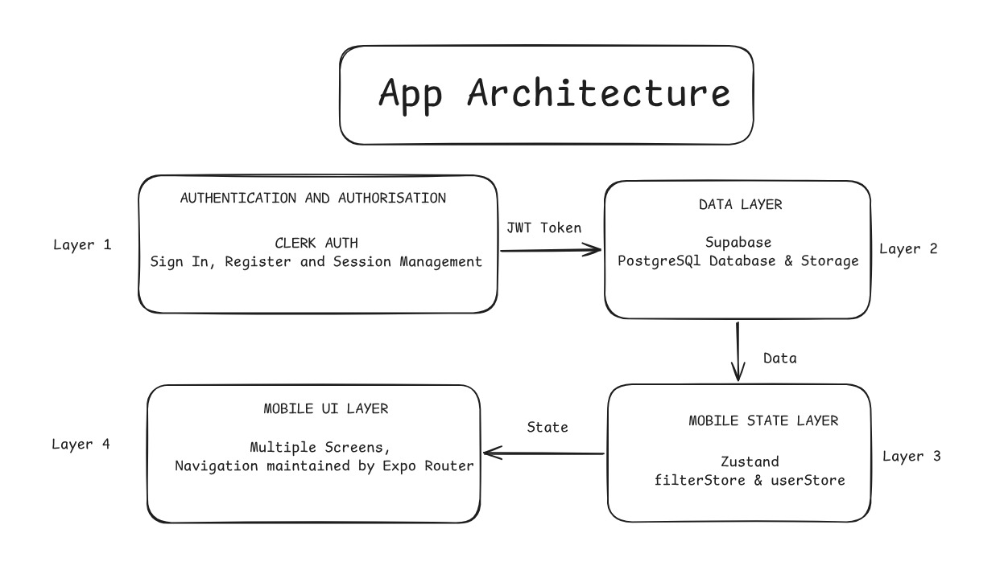

# Nestiq 🏠

A cross-platform real estate marketplace for iOS and Android.
Built with Expo and TypeScript that actually work.

---
## features

- 🗺️ Map-based property discovery via react-native-maps
- 🔐 Clerk OAuth authentication with Google sign-in
- 🛡️ Row Level Security (RLS) on Supabase for role-based access
- 👤 Admin panel for property management
- 🔍 Geolocation filtering and image gallery listings
- 💾 User-specific saved listings
- ⚡ Reanimated 4 gesture-driven animations
- 🎛️ Bottom sheet filter interface

---

## tech stack

| layer | tech |
|-------|------|
| framework | Expo · React Native |
| language | TypeScript |
| styling | NativeWind |
| auth | Clerk |
| database | Supabase (PostgreSQL + RLS) |
| state | Zustand |
| animations | Reanimated 4 |
| maps | react-native-maps |

---

## architecture

Nestiq follows a 4-layer architecture — auth, data, state, 
and UI — cleanly separated for scalability.



---

## getting started

```bash
git clone https://github.com/codeEnthusiast21/Nestiq.git
cd Nestiq
npm install
npx expo start
```

Add a `.env` file with the following:

```bash
EXPO_PUBLIC_CLERK_PUBLISHABLE_KEY=
EXPO_PUBLIC_SUPABASE_URL=
EXPO_PUBLIC_SUPABASE_ANON_KEY=
```

---

built by [Aviral Agarwal](https://github.com/codeEnthusiast21)
